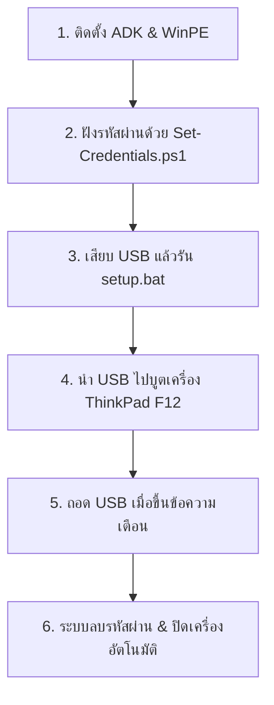

# 🚀 Lenovo USB Password Deleter & BIOS Automation Tool

ระบบจัดการและลบรหัสผ่าน BIOS, Power-On Password และ Hard Disk Password แบบอัตโนมัติสำหรับโน้ตบุ๊ก **Lenovo ThinkPad** (รองรับ L15 Gen 2, X13 Gen 2 และตระกูลใกล้เคียง) ผ่านสภาพแวดล้อม **WinPE (UEFI Boot)** แบบ Zero-Touch 100%

---

## 📋 สรุปการทำงานของระบบ
1. **Zero-Touch RAM Execution**: บูตผ่าน USB แฟลชไดรฟ์ เมื่อโหลดเข้า RAM แล้วสามารถถอด USB ออกไปเสียบเครื่องถัดไปได้ทันที
2. **ล้างรหัสผ่านครบวงจร (3 Passwords)**:
   - 🔑 **Supervisor Password (SVP)**: ลบ Master Password หน้า BIOS
   - 🔑 **Power-On Password (POP)**: ลบรหัสผ่านตอนเปิดเครื่อง
   - 🔑 **Hard Disk / NVMe Password (HDP)**: ลบรหัสผ่านล็อกไดรฟ์ SSD/HDD
3. **กำหนดค่า BIOS มาตรฐาน**: ปิด Secure Boot และตั้งลำดับการบูตกลับไปยังฮาร์ดดิสก์หลัก (`HDD0`) อัตโนมัติ
4. **ความปลอดภัยสูง**: รหัสผ่านจะถูกเข้ารหัส AES-256 ฝังไว้ในตัวบูต ไม่มี Plain-Text หลุดออกไป

---

## 🛠️ อุปกรณ์และสิ่งที่ต้องเตรียม
1. **USB Flash Drive**: ขนาด 4GB ขึ้นไป (⚠️ **ข้อมูลในแฟลชไดรฟ์จะถูก Format ลบทั้งหมด**)
2. **เครื่องคอมพิวเตอร์สำหรับสร้าง USB (Windows 10/11)**
3. **รหัสผ่านเดิมของเครื่องเป้าหมาย**:
   - **รหัสที่ 1:** Supervisor Password (SVP)
   - **รหัสที่ 2:** Power-On & Hard Disk Password (ใช้รหัสเดียวกัน)

---

## 📖 คู่มือการสร้างและใช้งานตั้งแต่เริ่มต้น (Flash Drive ใหม่เอี่ยม)



### ขั้นตอนที่ 1: ติดตั้งเครื่องมือ Windows ADK (ทำครั้งเดียวต่อเครื่องคอมพิวเตอร์)
หากเครื่องของคุณยังไม่ได้ติดตั้ง Windows ADK ให้เปิด PowerShell แล้วรันคำสั่ง:
```powershell
powershell -ExecutionPolicy Bypass -File .\Install-ADK.ps1
```
*(รอประมาณ 5–10 นาทีจนกว่าการติดตั้งเสร็จสมบูรณ์)*

---

### ขั้นตอนที่ 2: ตั้งค่ารหัสผ่านที่ต้องการลบ (`Set-Credentials.ps1`)
1. รันสคริปต์สำหรับเข้ารหัสผ่าน PowerShell:
   ```powershell
   powershell -ExecutionPolicy Bypass -File .\Lenovo\Tools\Set-Credentials.ps1
   ```
   *(หรือคลิกขวาที่ไฟล์ `Set-Credentials.ps1` แล้วเลือก **Run with PowerShell**)*
2. กรอกรหัสผ่าน 2 ครั้งตามหน้าจอ:
   - **[1/2] Supervisor Password**: กรอกรหัส Master BIOS
   - **[2/2] Power-On & Hard Disk Password**: กรอกรหัสเปิดเครื่อง/ฮาร์ดดิสก์
3. ระบบจะเข้ารหัส AES-256 และบันทึกลงในโฟลเดอร์ `Config\supervisor.txt` และ `Config\pop_hdd.txt` อัตโนมัติ

---

### ขั้นตอนที่ 3: เสียบ Flash Drive และสร้างตัวบูต (`setup.bat`)
1. เสียบ **USB Flash Drive** เข้าเครื่องคอมพิวเตอร์
2. คลิกขวาที่ไฟล์ **`setup.bat`** แล้วเลือก **"Run as administrator" (เรียกใช้งานในฐานะผู้ดูแลระบบ)**
3. สคริปต์จะค้นหาไดรฟ์ USB และแสดงข้อความยืนยัน
4. กด Enter เพื่อเริ่มสร้างตัวบูต WinPE ระบบจะทำการ:
   - ดึงไฟล์ WinPE และฉีด Packages (WMI, PowerShell, NetFX, Scripting)
   - ก๊อปปี้ไฟล์สคริปต์และ Config รหัสผ่านลงในตัวบูต
   - Format และเขียน WinPE ลง USB Flash Drive
5. เมื่อเสร็จสิ้นจะขึ้นข้อความ `Process Completed.` สามารถดึง USB ออกได้

---

### ขั้นตอนที่ 4: นำ Flash Drive ไปรันบนเครื่องเป้าหมาย (Lenovo ThinkPad)
1. นำ USB Flash Drive ไปเสียบที่เครื่อง Lenovo ThinkPad เป้าหมาย
2. กดปุ่มเปิดเครื่อง แล้วกดปุ่ม **F12** รัวๆ เพื่อเข้า **Boot Menu**
3. เลือกบูตจากรายการ **USB HDD**
4. เมื่อเข้าสู่หน้าต่างสีดำ WinPE ระบบจะตรวจจับอุปกรณ์และขึ้นข้อความ:
   ```text
   >>> PLEASE UNPLUG THE USB DRIVE NOW <<<
   ```
5. **ดึง Flash Drive ออกทันที** (สามารถนำแฟลชไดรฟ์ไปเสียบเครื่องถัดไปต่อได้เลย)
6. ระบบจะประมวลผลต่อใน RAM โดยอัตโนมัติ:
   - ปรับค่า BIOS และปิด Secure Boot
   - สั่งลบ Power-On Password
   - สั่งลบ Hard Disk / NVMe Password
   - สั่งลบ Supervisor Password
   - ปรับลำดับการบูตกลับไปยัง internal drive
   - ตรวจสอบความสมบูรณ์ (Verification)
7. เมื่อขึ้นแถบสีเขียว **`SUCCESS`** เครื่องจะนับถอยหลัง 5 วินาทีและ **ปิดเครื่องเองโดยอัตโนมัติ (Shutdown)**

---

## 📁 โครงสร้างโปรเจกต์ (Project Structure)

```text
USB_PasswordDeleter/
├── Config/                      # โฟลเดอร์เก็บ Credentials ที่เข้ารหัสแล้ว (ไม่ถูก Push ขึ้น Git)
│   ├── supervisor.txt           # รหัส Supervisor เข้ารหัส AES-256
│   └── pop_hdd.txt              # รหัส Power-On & HDD เข้ารหัส AES-256
├── Lenovo/
│   └── Tools/
│       └── Set-Credentials.ps1  # สคริปต์กรอกและเข้ารหัสผ่าน
├── Scripts/
│   ├── Main.ps1                 # สคริปต์หลักที่รันอัตโนมัติบน WinPE
│   ├── Detect-Hardware.ps1      # ตรวจสอบรุ่นเครื่อง (Machine Type)
│   ├── Detect-Configuration.ps1 # อ่านค่าสถานะ BIOS/WMI ปัจจุบัน
│   ├── Detect-USBRemoval.ps1    # ลูปตรวจจับการถอด USB ก่อนเริ่มงาน
│   ├── Apply-Configuration.ps1  # โมดูลสั่งล้างรหัสผ่านและตั้งค่า BIOS
│   ├── BootOrder.ps1            # โมดูลกู้คืนลำดับการบูต HDD0
│   ├── Verify-Configuration.ps1 # โมดูลตรวจสอบผลลัพธ์หลังแก้ไข
│   └── Logging.ps1              # โมดูลบันทึก Audit Log
├── CheatSheet.md                # รวมคำสั่งลัด WMI และคู่มือการบิลด์ Manual
├── Install-ADK.ps1              # ตัวช่วยติดตั้ง Windows ADK อัตโนมัติ
├── README.md                    # คู่มือการใช้งานฉบับสมบูรณ์
├── Roadmap.md                   # แผนการพัฒนาระบบ
└── setup.bat                    # ตัวสร้าง USB Bootable แบบคลิกเดียว
```

---

## ⚠️ การแก้ไขปัญหา (Troubleshooting)

| อาการ | สาเหตุที่เป็นไปได้ | แนวทางแก้ไข |
| :--- | :--- | :--- |
| **ขึ้นแถบแดง `MANUAL REQUIRED: Unsupported Machine Type`** | เครื่องเป้าหมายไม่ใช่รุ่นที่อนุญาตในลิสต์ (L15/X13 Gen 2) | ตรวจสอบ Machine Type ใน `Scripts\Main.ps1` และเพิ่มรุ่นเข้าไปหากต้องการรองรับ |
| **ขึ้น `Configuration failed` หรือ Password ไม่ถูกลบ** | รหัสผ่านเดิมที่กรอกใน `Set-Credentials.ps1` ไม่ถูกต้อง | รัน `Set-Credentials.ps1` ใหม่ แล้วกรอกรหัสเดิมให้ถูกต้อง จากนั้นรัน `setup.bat` ใหม่ |
| **รัน `setup.bat` แล้วขึ้น Error สิทธิ์** | ไม่ได้เปิดด้วยสิทธิ์ Administrator | คลิกขวาที่ `setup.bat` -> เลือก **Run as administrator** |
