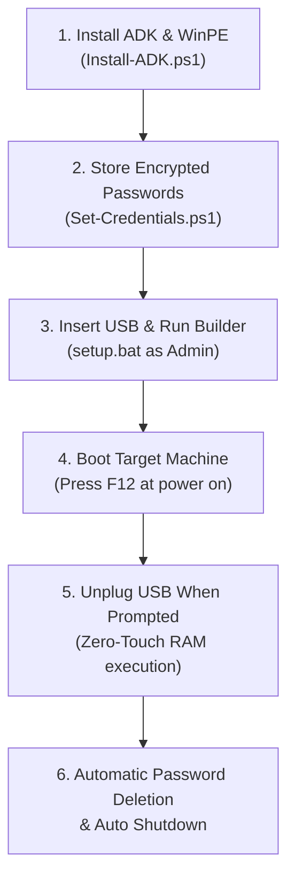

# 🚀 Lenovo UEFI WinPE Password Deleter & Automation Framework

An enterprise-grade, offline UEFI WinPE automation framework designed to remove Supervisor passwords, Power-On passwords, and Hard Disk / NVMe / M.2 passwords across **Lenovo ThinkPad** laptops and **ThinkCentre Tiny** desktops (including ThinkPad L15, X13, and ThinkCentre M90q/M70q/M80q) with 100% Zero-Touch RAM execution.

---

## 📋 System Overview & Key Capabilities

1. **Zero-Touch RAM Execution**:
   - The boot image loads entirely into RAM (`X:\`). Once loaded, technicians can immediately unplug the USB drive and reuse it on the next machine in the assembly line.
2. **Comprehensive Password Deletion**:
   - 🔑 **Supervisor Password (SVP)**: Clears the master BIOS administrative password (`pap`).
   - 🔑 **Power-On Password (POP)**: Clears the boot authorization prompt (`pop`).
   - 🔑 **Hard Disk / NVMe / M.2 Password**: Clears storage locks (`uhdp1`, `mhdp1`, `uhdp2`, `mhdp2`, `udrp1`, `adrp1`).
3. **Multi-Generation WMI Architecture**:
   - Utilizes the modern `Lenovo_WmiOpcodeInterface` standard for 2020+ ThinkPads and ThinkCentre desktops.
   - Automatically handles desktop admin authorization (`WmiOpcodePasswordAdmin`) on ThinkCentre M-series.
   - Falls back gracefully to legacy `Lenovo_SetBiosPassword` on older models.
4. **AES-256 Encrypted Credential Store**:
   - Authorization credentials are encrypted with AES-256 before injection into the WinPE image. No plaintext passwords exist in scripts or storage.
5. **Automated Audit Trail**:
   - Automatically records machine serial numbers, model types, BIOS versions, and operation outcomes to `audit.csv`.

---

## 🛠️ Supported Hardware

- **ThinkPad L-Series**: L15 Gen 1, L15 Gen 2, L14, etc. (Machine Types: `20X3`, `20X4`, `20U7`, `20U8`, etc.)
- **ThinkPad X-Series / T-Series**: X13 Gen 2, T14 Gen 2, etc. (Machine Types: `20WK`, `20WL`, `20XH`, `20XJ`, etc.)
- **ThinkCentre Tiny Desktops**: M90q, M80q, M70q (Gen 1, Gen 2, Gen 3, Gen 4)
- **Universal Lenovo Detection**: Dynamically supports all authentic Lenovo systems.

---

## 📖 End-to-End Setup & Deployment Guide



### Step 1: Install Windows ADK & WinPE Add-on (Host PC)
If the host PC does not already have the Windows ADK and WinPE Add-on installed:
1. Open PowerShell as Administrator in the repository folder.
2. Run:
   ```powershell
   powershell -ExecutionPolicy Bypass -File .\Install-ADK.ps1
   ```

---

### Step 2: Store Encrypted Passwords (`Set-Credentials.ps1`)
1. Run the credential generator script:
   ```powershell
   powershell -ExecutionPolicy Bypass -File .\Lenovo\Tools\Set-Credentials.ps1
   ```
2. Enter the passwords when prompted:
   - **Supervisor Password**: Enter the current master BIOS password.
   - **Power-On & Hard Disk Password**: Enter the current boot/storage password.
3. Encrypted blobs are securely saved to `Config\supervisor.txt` and `Config\pop_hdd.txt`.

---

### Step 3: Build the Bootable USB Drive (`setup.bat`)
1. Plug your **USB Flash Drive** into the Host PC.
2. **Right-click `setup.bat`** and choose **"Run as administrator"**.
3. The script automatically:
   - Mounts the base `boot.wim` image.
   - Injects required WinPE components (`WMI`, `NetFX`, `Scripting`, `PowerShell`, `StorageWMI`).
   - Copies automation modules while excluding boot bloat.
   - Writes the bootable WinPE media directly to the USB drive.

> [!TIP]
> **Duplicating Flash Drives**: Run `Duplicate-USB.bat` as Administrator to clone the compiled WinPE image to additional flash drives instantly without rebuilding.

---

### Step 4: Deploy on Target Machines
1. Plug the USB Flash Drive into the target machine.
2. Power on and press **F12** to enter the **Boot Menu**.
3. Select **USB HDD**.
4. When the yellow prompt appears, **unplug the USB drive** and proceed to the next machine.
5. The automation script executes in RAM, clears all passwords, logs the serial number, and powers down the machine.

---

## 📁 Repository Structure

```text
USB_PasswordDeleter/
├── Config/                      # Local encrypted credentials (git-ignored)
│   ├── supervisor.txt           # AES-256 encrypted Supervisor Password
│   └── pop_hdd.txt              # AES-256 encrypted Power-On & HDD Password
├── Lenovo/
│   └── Tools/
│       └── Set-Credentials.ps1  # Tool to generate AES-256 encrypted credential files
├── Scripts/
│   ├── Main.ps1                 # Master WinPE orchestrator
│   ├── Detect-Hardware.ps1      # Queries machine type, serial, and hardware specs
│   ├── Detect-Configuration.ps1 # Evaluates BIOS PasswordState bitmask via WMI
│   ├── Detect-USBRemoval.ps1    # Polling loop detecting USB extraction for zero-touch workflow
│   ├── Apply-Configuration.ps1  # Core engine executing WmiOpcodeInterface password deletion
│   ├── BootOrder.ps1            # Internal boot priority utility
│   ├── Verify-Configuration.ps1 # Audits post-execution state and handles reboot-commit validation
│   └── Logging.ps1              # Writes execution telemetry to audit.csv
├── CheatSheet.md                # Quick manual reference and WMI query cheatsheet
├── Install-ADK.ps1              # Automated Windows ADK and WinPE downloader/installer
├── README.md                    # Comprehensive documentation and deployment guide
├── Roadmap.md                   # Development roadmap
├── setup.bat                    # One-click Admin build script for master USB creation
├── Duplicate-USB.bat            # Fast flash drive cloner for scaling deployment
└── Clean-USB.bat                # Utility to wipe and restore glitched/locked USB flash drives
```
