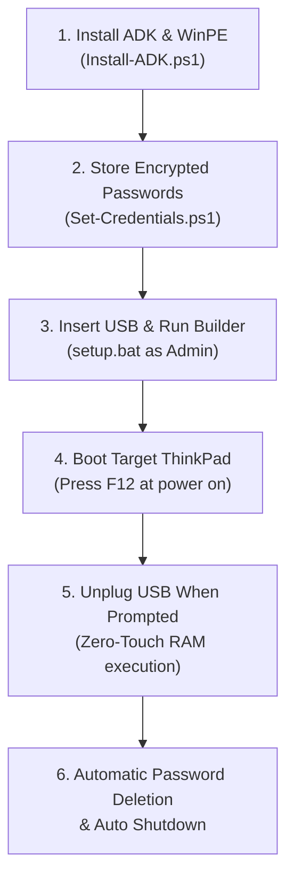

# 🚀 Lenovo ThinkPad UEFI WinPE Password Deleter & Automation Tool

An enterprise-grade, offline UEFI WinPE automation framework designed to remove BIOS passwords, Power-On passwords, and Hard Disk passwords, while standardizing firmware configurations on **Lenovo ThinkPad** laptops (such as L15 Gen 2, X13 Gen 2, and related enterprise models) with 100% Zero-Touch RAM execution.

---

## 📋 System Overview & Key Capabilities

1. **Zero-Touch RAM Execution**:
   - The boot image loads entirely into RAM (`X:\`). Once loaded, technicians can immediately unplug the USB drive and reuse it on the next machine in the assembly line.
2. **Complete 3-in-1 Password Deletion**:
   - 🔑 **Supervisor Password (SVP)**: Clears the master BIOS administrative password (`pap`).
   - 🔑 **Power-On Password (POP)**: Clears the boot authorization prompt (`pop`).
   - 🔑 **Hard Disk / NVMe Password (HDP)**: Clears the internal storage lock (`hdp`, `hdp1`, `mhp`).
3. **BIOS Standardization**:
   - Automatically disables **Secure Boot**.
   - Restores internal storage (`HDD0`) as the primary boot option.
4. **AES-256 Encrypted Credential Store**:
   - Authorization credentials are encrypted with AES-256 before injection into the WinPE image. No plaintext passwords exist in scripts or storage.
5. **Automated Audit Trail**:
   - Automatically records machine serial numbers, model types, BIOS versions, and operation outcomes to `audit.csv`.

---

## 🛠️ Prerequisites

- **USB Flash Drive**: 4 GB minimum (⚠️ *All existing data on this drive will be formatted and erased*).
- **Host PC**: Running Windows 10 or Windows 11 to create the WinPE boot media.
- **Original Credentials**:
  - `Supervisor Password (SVP)`: Current master BIOS password.
  - `Power-On & Hard Disk Password`: Current password for power-on and SSD/HDD locks (sharing the same password).

---

## 📖 End-to-End Setup Guide (From a Fresh USB Flash Drive)



### Step 1: Install Windows ADK & WinPE Add-on (Host PC)
If the host PC does not already have the Windows ADK and WinPE Add-on installed:
1. Open PowerShell as Administrator in the repository folder.
2. Run the automated installer:
   ```powershell
   powershell -ExecutionPolicy Bypass -File .\Install-ADK.ps1
   ```
3. Wait for the download and silent installation to finish (approx. 5–10 minutes).

---

### Step 2: Encrypt Target Passwords (`Set-Credentials.ps1`)
1. Run the credential generator script:
   ```powershell
   powershell -ExecutionPolicy Bypass -File .\Lenovo\Tools\Set-Credentials.ps1
   ```
   *(Or right-click `Set-Credentials.ps1` and select **Run with PowerShell**)*.
2. Enter the passwords when prompted:
   - **[1/2] Supervisor Password**: Enter the current master BIOS password.
   - **[2/2] Power-On & Hard Disk Password**: Enter the current boot/storage password.
3. The script securely writes encrypted blobs to `Config\supervisor.txt` and `Config\pop_hdd.txt`.

---

### Step 3: Build the Bootable USB Drive (`setup.bat`)
1. Plug your **USB Flash Drive** into the Host PC.
2. **Right-click `setup.bat`** and choose **"Run as administrator"**.
3. The script will automatically:
   - Detect the removable USB drive letter (e.g., `G:`).
   - Mount the base `boot.wim` image.
   - Inject required WinPE optional components (`WMI`, `NetFX`, `Scripting`, `PowerShell`, `StorageWMI`).
   - Copy all automation scripts and encrypted credentials into the image.
   - Configure `startnet.cmd` to launch `Main.ps1` automatically on boot.
   - Format and write the bootable image to the USB drive.
4. When finished, you will see `SUCCESS: Bootable WinPE USB is ready`.

---

### Step 4: Deploy on Target Laptops (Lenovo ThinkPad)
1. Plug the USB Flash Drive into the target ThinkPad laptop.
2. Power on the laptop and immediately press **F12** repeatedly to enter the **Boot Menu**.
3. Select **USB HDD** from the boot list.
4. Once the WinPE terminal loads, a yellow banner will appear:
   ```text
   ================================================
           PLEASE REMOVE USB FLASH DRIVE
           กรุณาถอด Flash Drive ออกจากเครื่อง
   ================================================
   ```
5. **Unplug the USB Flash Drive immediately**. You can plug it into the next machine right away.
6. The script continues running automatically in RAM:
   - Disables Secure Boot.
   - Restores internal boot priority (`HDD0`).
   - Clears Power-On Password.
   - Clears Hard Disk / NVMe Password.
   - Clears Supervisor Password.
   - Runs post-configuration verification.
7. Upon displaying the green **`SUCCESS`** screen, the laptop will automatically shut down in 5 seconds.

---

## 📁 Repository Structure

```text
USB_PasswordDeleter/
├── Config/                      # Local encrypted credentials (git-ignored for security)
│   ├── supervisor.txt           # AES-256 encrypted Supervisor Password
│   └── pop_hdd.txt              # AES-256 encrypted Power-On & HDD Password
├── Lenovo/
│   └── Tools/
│       └── Set-Credentials.ps1  # Tool to generate AES-256 encrypted credential files
├── Scripts/
│   ├── Main.ps1                 # Master WinPE orchestrator
│   ├── Detect-Hardware.ps1      # Queries machine type, serial, and specs
│   ├── Detect-Configuration.ps1 # Queries active BIOS WMI settings and password states
│   ├── Detect-USBRemoval.ps1    # Polling loop detecting USB extraction for zero-touch workflow
│   ├── Apply-Configuration.ps1  # Core module executing WMI password deletion and BIOS modifications
│   ├── BootOrder.ps1            # Restores internal drive (HDD0) boot priority
│   ├── Verify-Configuration.ps1 # Audits post-execution state to ensure clean configuration
│   └── Logging.ps1              # Writes execution telemetry to audit.csv
├── CheatSheet.md                # Quick manual reference and WMI query cheatsheet
├── Install-ADK.ps1              # Automated Windows ADK and WinPE downloader/installer
├── README.md                    # Comprehensive documentation and deployment guide
├── Roadmap.md                   # Development roadmap
└── setup.bat                    # One-click Admin build script for USB creation
```

---

## 🔍 Supported Machine Types

The default filter in [Detect-Hardware.ps1](file:///c:/Users/MewMew/Desktop/Co-op/USB_PasswordDeleter/Scripts/Detect-Hardware.ps1) and [Main.ps1](file:///c:/Users/MewMew/Desktop/Co-op/USB_PasswordDeleter/Scripts/Main.ps1) targets the following Lenovo Machine Types:
- `20X3`, `20X4` (ThinkPad L15 Gen 2 Intel)
- `20U7`, `20U8` (ThinkPad L15 Gen 1 AMD / Intel)
- `20WK`, `20WL` (ThinkPad X13 Gen 2 Intel)
- `20XH`, `20XJ` (ThinkPad X13 Gen 2 AMD)

*To add more models, append the 4-character Machine Type to `$supportedModels` in `Scripts\Main.ps1`.*

---

## ❓ Troubleshooting

| Issue / Symptom | Possible Cause | Resolution |
| :--- | :--- | :--- |
| **Red Banner: `MANUAL REQUIRED: Unsupported Machine Type`** | The laptop is not in the approved model list. | Verify the Machine Type on the bottom label or add it to `$supportedModels` in `Scripts\Main.ps1`. |
| **`Configuration failed` or passwords still active** | Incorrect original passwords entered during setup. | Run `Set-Credentials.ps1` again with the correct existing passwords, then re-run `setup.bat`. |
| **`setup.bat` fails with Administrator permission error** | Script was launched without elevated privileges. | Right-click `setup.bat` and select **"Run as administrator"**. |
| **USB detection stuck on boot screen** | An internal USB device (e.g. card reader) is detected as removable. | Press **Enter** or **Spacebar** on the laptop keyboard to manually bypass the check. |
